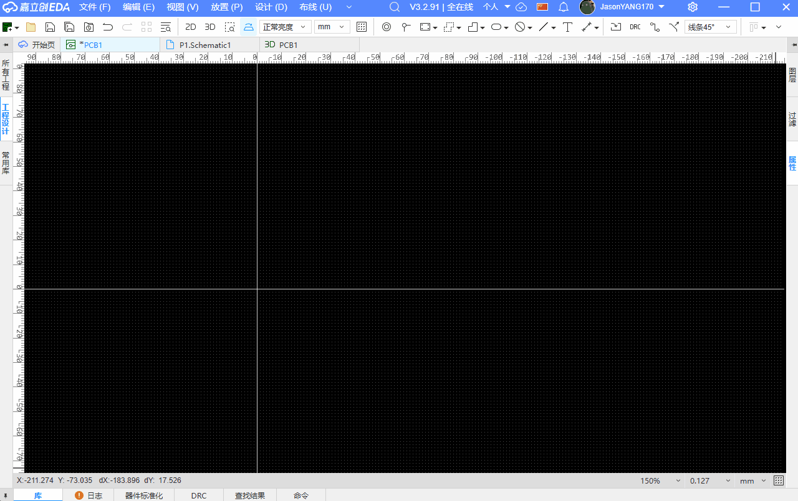

## Image Contour Extractor

[中文](./README.md)

A graphic assistant tool for creating artistic PCBs based on images. You can quickly build an artistic PCB with just one image.

**Contour recognition accuracy is significantly affected by the effective image resolution and local contrast.**
**Supports images in PNG/JPG/JPEG/BMP/WEBP/SVG formats**

## Supported Features

### ✅ Custom extraction parameters, freely adjust contour details

### ✅ One-click contour extraction, quickly build an artistic PCB from a single image

### ✅ One-click contour inversion, get two effects from one image, no need for image masking

### ✅ Generate contours based on graphics, quickly create irregular board frames without DXF

### ✅ Generate fills based on graphics, quickly create irregular solder mask openings without binarization

### ✅ Custom graphic sizes, make it as big as you want without adjusting in design software

## Panel Application
Currently, the generated board frames can be exported as DXF and then imported into the panel for use.

## How to Use
1. Go to "Advanced" - "Extension Manager" and import the eext-image-contour-to-pcb.eext extension file.

2. Enter the PCB interface, click "Advanced" on the top navigation bar - "Image Contour Extractor" and select the image you want to extract.

