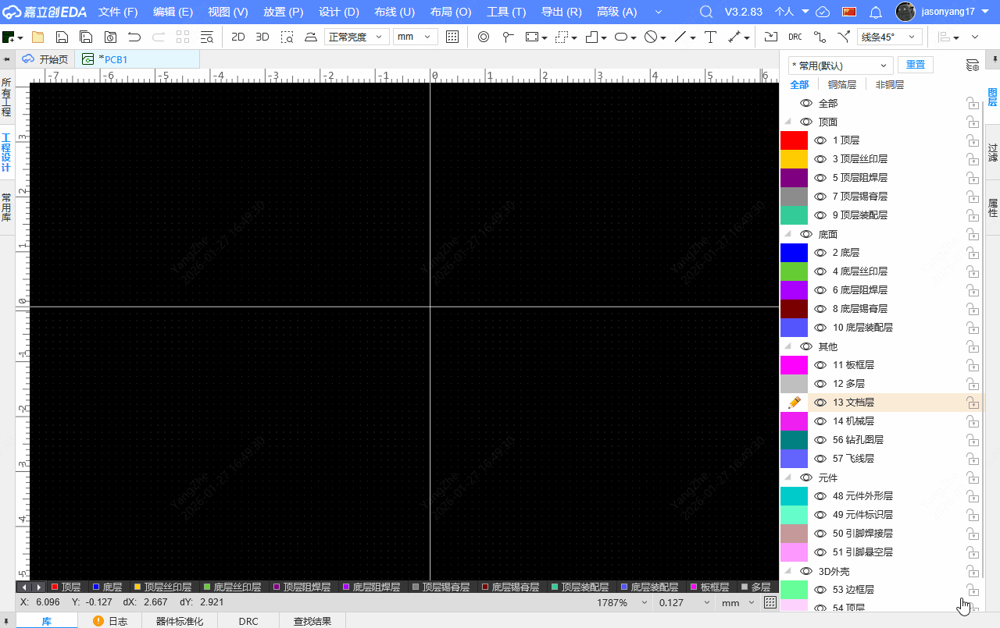
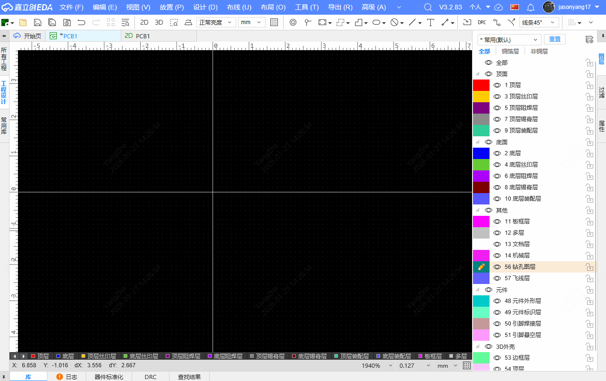
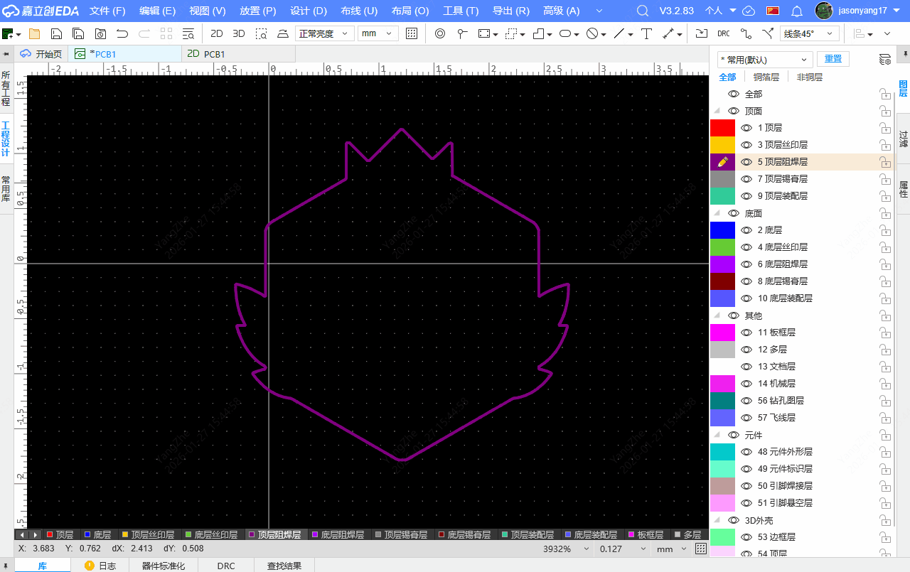
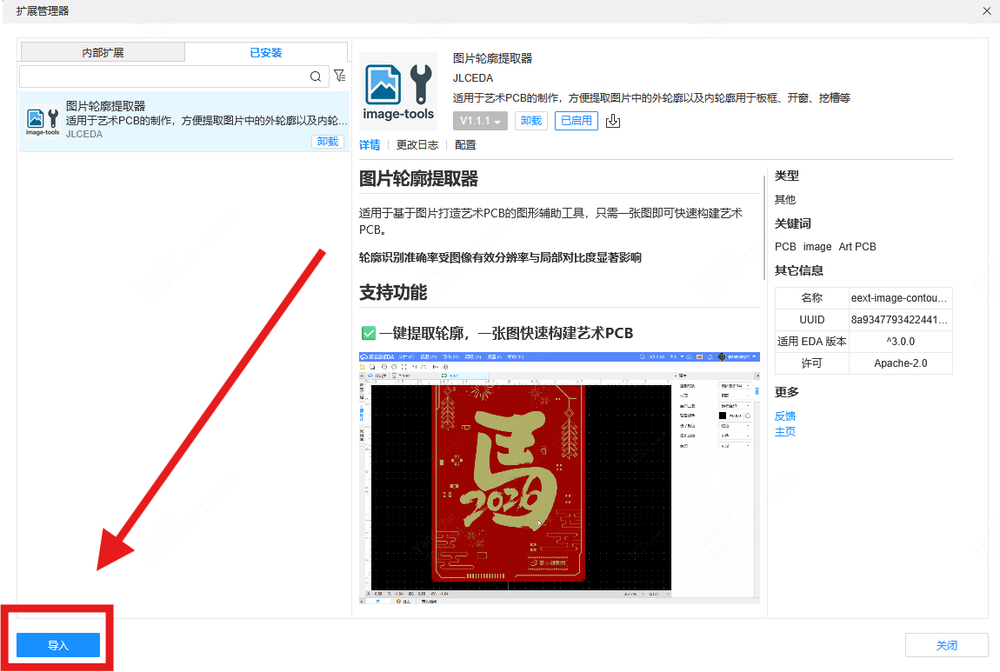
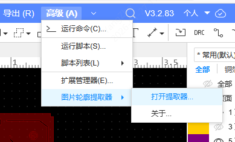

## 图片轮廓提取器

适用于基于图片打造艺术PCB的图形辅助工具，只需一张图即可快速构建艺术PCB。

**轮廓识别准确率受图像有效分辨率与局部对比度显著影响**
**支持PNG/JPG/JPEG/BMP/WEBP/SVG格式的图片**

## 支持功能
### ✅一键提取轮廓，一张图快速构建艺术PCB

### ✅一键轮廓取反，一张图片两种效果，无需抠图

### ✅根据图形生成轮廓，快速构建异形板框，无须DXF

### ✅根据图形生成填充，快速构建异形阻焊开窗，无需二值化

### ✅自定义图形尺寸，想要多大就多大，无需再用设计软件调整

## 面板应用
目前可以将生成的板框导出DXF然后再导入面板使用

## 使用方法
1.在"高级"-"扩展管理器"中导入eext-image-contour-to-pcb.eext扩展文件。

2.进入PCB界面，点击顶部导航栏"高级"-"图片轮廓提取器"选择需要提取的图片即可。

